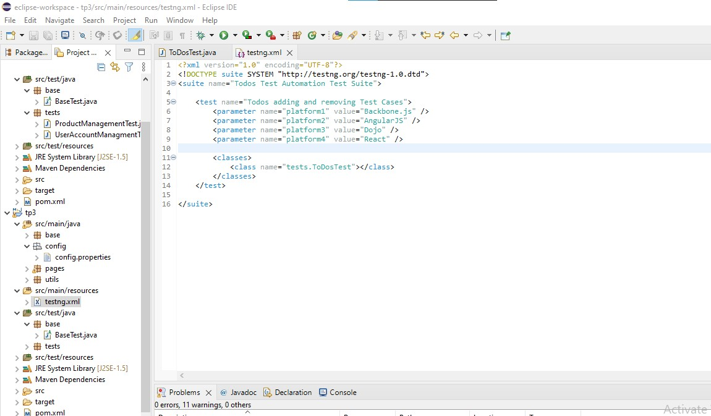

### TP n° 3 en Qualité Logicielle
<h1 align=center >
  TestNG with Selenium
</h1>

This project is a continuation of [JUnit with Selenium project](https://github.com/yosra270/JUnit-with-Selenium). Here, we replace JUnit by TestNG since TestNG is an automation testing framework inspired by JUnit. TestNG overcomes the disadvantages of JUnit (parallel tests, advanced annotations, grouping tests, ease of use, ..) and is designed to make end-to-end testing easy.

we will be testing the same scenario :
* User chooses a platform
* User adds some todos
* User removes some todos

The test suite will be the following :

  

***Page Object Pattern*** is applied in this project too to get a **cleaner code**.
